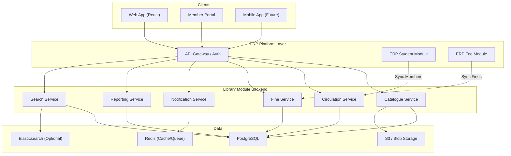
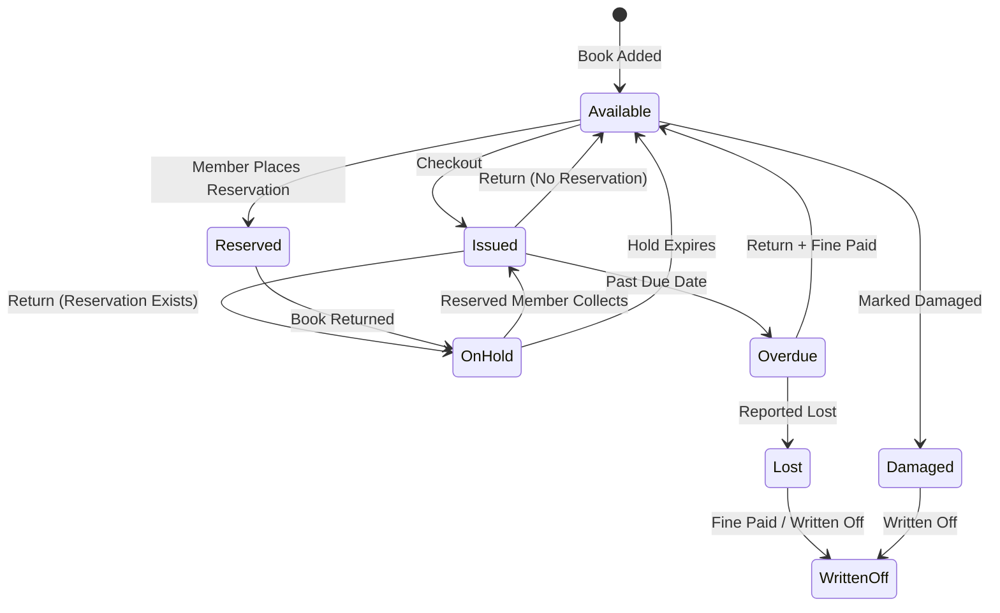
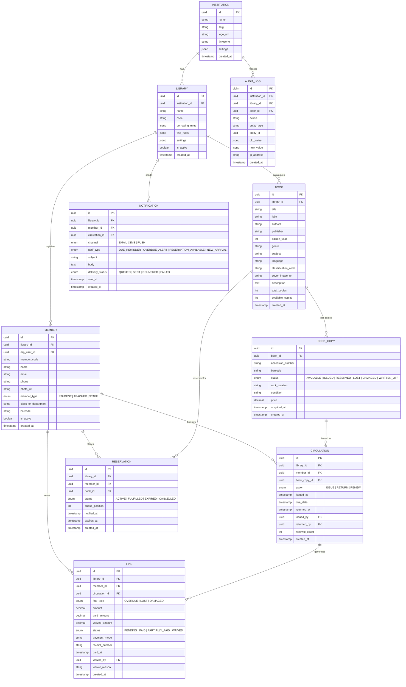
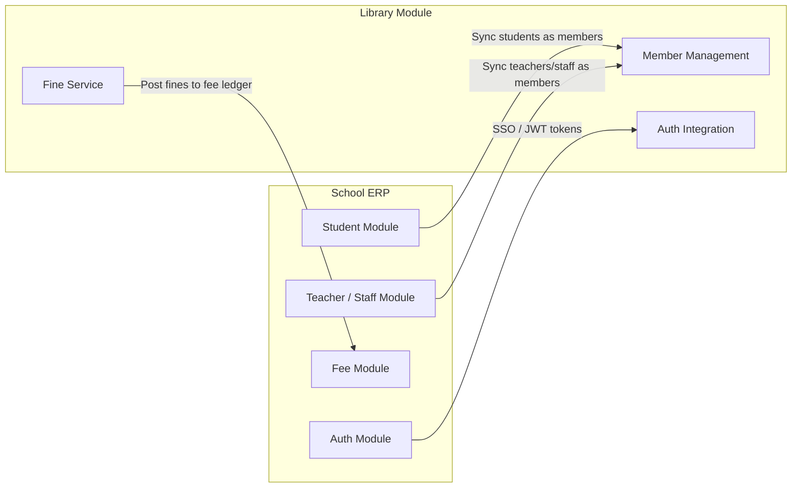

# Library Management System — Product Requirement Document (PRD)

> **Version**: 1.0 &nbsp;|&nbsp; **Date**: 2026-02-24 &nbsp;|&nbsp; **Status**: Draft  
> **Parent Product**: School ERP SaaS Platform

---

## 1. Product Overview

A **Library Management System (LMS)** is a scalable module within the School ERP SaaS platform that digitises the complete library operations — from cataloguing and acquisitions to circulation (issue/return), member management, fine collection, and analytics. It replaces manual registers and spreadsheets with a secure, multi-tenant, and auditable system designed specifically for **schools, colleges, and educational institutions**.

### 1.1 Key Personas

| Persona             | Description                                                                     |
| ------------------- | ------------------------------------------------------------------------------- |
| **Librarian**       | Manages catalogue, circulation, acquisitions, and day-to-day library operations |
| **Library Admin**   | Configures library policies, manages staff, generates reports                   |
| **Student**         | Searches catalogue, views issued books, places reservations, pays fines         |
| **Teacher / Staff** | Similar to student but may have extended borrowing privileges                   |
| **Parent**          | Views child's borrowing history and outstanding fines                           |
| **School Admin**    | Oversees the library module from the ERP admin panel                            |

---

## 2. Complete Feature List

Features are grouped into **functional categories**.

| #   | Category     | Feature                                                                    |
| --- | ------------ | -------------------------------------------------------------------------- |
| F01 | Catalogue    | Book cataloguing (title, author, ISBN, publisher, edition, genre, subject) |
| F02 | Catalogue    | Multi-copy and multi-volume tracking (accession numbers)                   |
| F03 | Catalogue    | Barcode / QR code generation for each copy                                 |
| F04 | Catalogue    | Digital media cataloguing (e-books, audiobooks, CDs/DVDs)                  |
| F05 | Catalogue    | MARC / Z39.50 / Open Library integration for auto-fill metadata            |
| F06 | Catalogue    | Book cover image upload / auto-fetch                                       |
| F07 | Catalogue    | Classification support (DDC / UDC / custom)                                |
| F08 | Search       | Full-text catalogue search (title, author, ISBN, subject, keyword)         |
| F09 | Search       | Advanced search with filters (genre, availability, language, rack)         |
| F10 | Search       | OPAC — Online Public Access Catalogue for students/staff                   |
| F11 | Circulation  | Book issue (checkout) to members                                           |
| F12 | Circulation  | Book return (check-in)                                                     |
| F13 | Circulation  | Book renewal (extend due date)                                             |
| F14 | Circulation  | Bulk issue / return via barcode scanner                                    |
| F15 | Circulation  | Re-issue / re-checkout workflows                                           |
| F16 | Reservation  | Book reservation / hold queue                                              |
| F17 | Reservation  | Auto-notification when reserved book is available                          |
| F18 | Membership   | Member registration (student, teacher, staff)                              |
| F19 | Membership   | Sync members from Student/Staff module in ERP                              |
| F20 | Membership   | Library card generation (with barcode/QR)                                  |
| F21 | Membership   | Category-based borrowing rules (student vs. staff limits)                  |
| F22 | Fine         | Auto fine calculation for overdue books                                    |
| F23 | Fine         | Configurable fine rules (per day, max cap, grace period)                   |
| F24 | Fine         | Fine payment tracking and receipts                                         |
| F25 | Fine         | Integration with ERP fee module for fine collection                        |
| F26 | Acquisition  | Book purchase request workflow                                             |
| F27 | Acquisition  | Vendor / supplier management                                               |
| F28 | Acquisition  | Purchase order creation and tracking                                       |
| F29 | Acquisition  | Budget allocation and tracking                                             |
| F30 | Periodical   | Magazine / journal / newspaper subscription tracking                       |
| F31 | Periodical   | Issue-wise tracking and circulation                                        |
| F32 | Stock        | Stock verification / inventory audit                                       |
| F33 | Stock        | Book condition tracking (good, damaged, lost, written-off)                 |
| F34 | Stock        | Rack / shelf / location mapping                                            |
| F35 | Reports      | Circulation reports (daily issue/return log)                               |
| F36 | Reports      | Member-wise borrowing history                                              |
| F37 | Reports      | Overdue books report                                                       |
| F38 | Reports      | Most borrowed / least borrowed books                                       |
| F39 | Reports      | Genre / subject-wise collection analytics                                  |
| F40 | Reports      | Fine collection report                                                     |
| F41 | Reports      | Stock register and accession register                                      |
| F42 | Notification | Due date reminder (Email / SMS / Push / In-app)                            |
| F43 | Notification | Overdue alerts to students and parents                                     |
| F44 | Notification | New arrival notifications                                                  |
| F45 | Admin        | Role-based access control (RBAC)                                           |
| F46 | Admin        | Library settings & policies configuration                                  |
| F47 | Admin        | Multi-branch / multi-campus library support                                |
| F48 | Admin        | Academic year / session management                                         |
| F49 | Admin        | Audit log                                                                  |
| F50 | Integration  | ERP Student module sync                                                    |
| F51 | Integration  | ERP Fee module sync (fines)                                                |
| F52 | Integration  | E-book / digital library integration (OPDS)                                |
| F53 | Integration  | SSO via ERP authentication                                                 |
| F54 | Mobile       | Mobile app for catalogue search and borrowing status                       |
| F55 | Mobile       | Barcode scanner via mobile camera                                          |
| F56 | Self-Service | Self-checkout / return kiosk (RFID/barcode)                                |
| F57 | Gamification | Reading challenges and leaderboards                                        |
| F58 | Gamification | Reading goals and badges for students                                      |

---

## 3. MVP — Core Product

The MVP focuses on **essential circulation and catalogue management** for a single-campus library.

| #   | MVP Feature                                | Maps to       |
| --- | ------------------------------------------ | ------------- |
| M01 | Book cataloguing with accession numbers    | F01, F02      |
| M02 | Barcode / QR code generation per book copy | F03           |
| M03 | Book cover image upload                    | F06           |
| M04 | Classification support (DDC / custom)      | F07           |
| M05 | Full-text catalogue search with filters    | F08, F09      |
| M06 | Book issue (checkout)                      | F11           |
| M07 | Book return (check-in)                     | F12           |
| M08 | Book renewal                               | F13           |
| M09 | Barcode-based issue / return               | F14           |
| M10 | Book reservation with hold queue           | F16           |
| M11 | Member registration & management           | F18           |
| M12 | Library card generation                    | F20           |
| M13 | Category-based borrowing rules             | F21           |
| M14 | Auto fine calculation for overdue books    | F22           |
| M15 | Configurable fine rules                    | F23           |
| M16 | Fine payment tracking                      | F24           |
| M17 | Basic reports (circulation, overdue, fine) | F35, F37, F40 |
| M18 | Member-wise borrowing history              | F36           |
| M19 | Due date reminders (email)                 | F42           |
| M20 | Overdue alerts                             | F43           |
| M21 | Role-based access control                  | F45           |
| M22 | Library settings & policy configuration    | F46           |
| M23 | Audit log                                  | F49           |

> [!TIP]
> The MVP is designed to be **deployable within 10–12 sprints** (2-week sprints) by a small team of 3–4 developers.

---

## 4. Add-On Modules (Post-MVP)

Each add-on is an independently licensable module layered on top of the core.

| Add-On Module                 | Features Included                                                 | Target Buyer                   |
| ----------------------------- | ----------------------------------------------------------------- | ------------------------------ |
| **OPAC — Public Catalogue**   | F10 (online catalogue portal for students/parents)                | All institutions               |
| **Digital Library**           | F04 (e-books, audiobooks), F52 (OPDS integration)                 | Tech-forward schools           |
| **Auto-Fill Metadata**        | F05 (MARC / Z39.50 / Open Library ISBN lookup)                    | Large libraries                |
| **Acquisition & Budget**      | F26, F27, F28, F29 (purchase requests, vendors, POs, budgets)     | Schools with dedicated budgets |
| **Periodical Management**     | F30, F31 (magazine/journal subscriptions, issue tracking)         | Colleges & universities        |
| **Advanced Stock Management** | F32, F33, F34 (inventory audit, condition tracking, rack mapping) | Large libraries                |
| **Advanced Analytics**        | F38, F39, F41 (popular books, genre analytics, stock register)    | Library admins & management    |
| **ERP Integration Pack**      | F19, F25, F50, F51, F53 (student sync, fee sync, SSO)             | Schools using full ERP         |
| **Multi-Campus Library**      | F47 (multi-branch support with inter-library transfers)           | Multi-campus institutions      |
| **Notification Suite**        | F17 (reservation alerts), F44 (new arrivals), SMS/Push channels   | All institutions               |
| **Mobile App**                | F54, F55 (catalogue search, barcode scanner)                      | Mobile-first schools           |
| **Self-Service Kiosk**        | F56 (RFID/barcode self-checkout)                                  | Large libraries                |
| **Gamification & Reading**    | F57, F58 (challenges, leaderboards, badges)                       | K-12 schools                   |

---

## 5. Functional Requirements

### 5.1 Catalogue Management

| ID    | Requirement                                                                                                                                                        |
| ----- | ------------------------------------------------------------------------------------------------------------------------------------------------------------------ |
| FR-01 | System **shall** allow a librarian to add a book by entering: title, author(s), ISBN, publisher, edition, year, genre, subject, language, and classification code. |
| FR-02 | System **shall** support multiple copies of the same book, each identified by a unique **accession number**.                                                       |
| FR-03 | System **shall** auto-generate a unique barcode/QR code for each accession (book copy).                                                                            |
| FR-04 | System **shall** allow uploading or auto-fetching a book cover image.                                                                                              |
| FR-05 | System **shall** support DDC (Dewey Decimal Classification) or custom classification schemes.                                                                      |
| FR-06 | System **shall** allow bulk import of books via CSV/Excel upload.                                                                                                  |
| FR-07 | System **shall** track the status of each book copy: `AVAILABLE`, `ISSUED`, `RESERVED`, `LOST`, `DAMAGED`, `WRITTEN_OFF`.                                          |

### 5.2 Search & Discovery

| ID    | Requirement                                                                                                          |
| ----- | -------------------------------------------------------------------------------------------------------------------- |
| FR-08 | System **shall** support full-text search across title, author, ISBN, subject, and keywords.                         |
| FR-09 | System **shall** provide filters for: genre, availability status, language, classification, and rack/shelf location. |
| FR-10 | Search results **shall** show real-time availability (total copies, available copies, issued copies).                |
| FR-11 | System **shall** display book detail page with metadata, availability, and borrowing history summary.                |

### 5.3 Membership Management

| ID    | Requirement                                                                                                                                    |
| ----- | ---------------------------------------------------------------------------------------------------------------------------------------------- |
| FR-12 | System **shall** allow registration of members with: name, member type (student/teacher/staff), class/department, contact details, and photo.  |
| FR-13 | System **shall** generate a library card with unique member ID and barcode/QR code.                                                            |
| FR-14 | System **shall** support configurable borrowing rules per member category: max books, loan period (days), max renewals, and reservation limit. |
| FR-15 | System **shall** validate borrowing rules at checkout (block if limit exceeded or outstanding fines beyond threshold).                         |
| FR-16 | System **shall** support deactivating members (e.g., graduated students) while retaining history.                                              |

### 5.4 Circulation — Issue / Return / Renew

| ID    | Requirement                                                                                                                                                 |
| ----- | ----------------------------------------------------------------------------------------------------------------------------------------------------------- |
| FR-17 | Librarian **shall** issue a book by scanning the member's library card + book barcode (or manual entry).                                                    |
| FR-18 | On issue, system **shall** calculate and display the due date based on the member category's loan period.                                                   |
| FR-19 | System **shall** prevent issuing a book if: member has exceeded max book limit, member has overdue fine above threshold, or the book copy is not available. |
| FR-20 | Librarian **shall** return a book by scanning the book barcode; system updates status and calculates any fine.                                              |
| FR-21 | System **shall** allow renewal (extending the due date) if: the book is not reserved by another member and max renewal count is not exceeded.               |
| FR-22 | System **shall** record all circulation transactions (issue, return, renew) with timestamps and acting librarian.                                           |
| FR-23 | System **shall** support bulk issue and return operations via continuous barcode scanning.                                                                  |

### 5.5 Reservation / Hold

| ID    | Requirement                                                                                                                                  |
| ----- | -------------------------------------------------------------------------------------------------------------------------------------------- |
| FR-24 | Member **shall** be able to place a reservation on a book that is currently issued out.                                                      |
| FR-25 | System **shall** maintain a first-come-first-served reservation queue per book title.                                                        |
| FR-26 | When a reserved book is returned, system **shall** place a hold and notify the first member in the queue.                                    |
| FR-27 | Hold **shall** expire after a configurable period (e.g., 48 hours) if the member does not collect, and the next member in queue is notified. |

### 5.6 Fine Management

| ID    | Requirement                                                                                                                               |
| ----- | ----------------------------------------------------------------------------------------------------------------------------------------- |
| FR-28 | System **shall** automatically calculate fines for overdue books based on configured rules: fine per day, grace period, and max fine cap. |
| FR-29 | Fine rules **shall** be configurable per member category (e.g., students ₹1/day, teachers ₹2/day).                                        |
| FR-30 | System **shall** allow librarians to waive or discount fines with an audit trail.                                                         |
| FR-31 | System **shall** record fine payments with receipt number, amount, payment mode, and date.                                                |
| FR-32 | System **shall** allow configuring a fine threshold beyond which further book issuance is blocked.                                        |
| FR-33 | Fines for lost/damaged books **shall** be configurable (replacement cost, fixed penalty, or both).                                        |

### 5.7 Notifications

| ID    | Requirement                                                                                                                        |
| ----- | ---------------------------------------------------------------------------------------------------------------------------------- |
| FR-34 | System **shall** send due-date reminder notifications to members N days before the due date (configurable).                        |
| FR-35 | System **shall** send overdue notifications daily/weekly (configurable) to the member and optionally to the parent (for students). |
| FR-36 | System **shall** support notification channels: email (MVP), with SMS, push, and in-app as add-ons.                                |
| FR-37 | System **shall** log all notifications with delivery status.                                                                       |

### 5.8 Reports & Analytics

| ID    | Requirement                                                                                                                                                          |
| ----- | -------------------------------------------------------------------------------------------------------------------------------------------------------------------- |
| FR-38 | System **shall** provide the following reports: daily issue/return log, overdue books, fine collection, member borrowing history, and genre-wise collection summary. |
| FR-39 | Reports **shall** support filters: date range, member category, class/department, genre, and status.                                                                 |
| FR-40 | System **shall** allow export of reports to CSV and PDF formats.                                                                                                     |
| FR-41 | System **shall** provide a librarian dashboard showing: total books, active members, books issued today, overdue count, and fine collected this month.               |

### 5.9 Administration & Security

| ID    | Requirement                                                                                                                                            |
| ----- | ------------------------------------------------------------------------------------------------------------------------------------------------------ |
| FR-42 | System **shall** enforce role-based access with at least four roles: **School Admin**, **Library Admin**, **Librarian**, **Member (Student/Teacher)**. |
| FR-43 | Library Admin **shall** be able to configure: library name, academic year, borrowing rules, fine rules, working days, and notification preferences.    |
| FR-44 | System **shall** maintain an immutable audit log of all actions (issue, return, fine waiver, catalogue edits, settings changes).                       |
| FR-45 | Audit log entries **shall** include: actor, action, entity, old/new values, timestamp, and IP address.                                                 |
| FR-46 | All API endpoints **shall** require authentication via the ERP's auth system (JWT/session).                                                            |
| FR-47 | System **shall** support academic year/session rollover — archiving data and resetting counters while retaining historical records.                    |

### 5.10 Non-Functional Requirements

| ID     | Requirement                                                                                      |
| ------ | ------------------------------------------------------------------------------------------------ |
| NFR-01 | System **shall** respond to API requests within 300 ms (p95) under normal load.                  |
| NFR-02 | System **shall** support at least 1000 concurrent users per tenant (institution).                |
| NFR-03 | System **shall** be horizontally scalable (stateless API layer).                                 |
| NFR-04 | Data at rest **shall** be encrypted (AES-256). Data in transit **shall** use TLS 1.2+.           |
| NFR-05 | System **shall** have 99.9% uptime SLA.                                                          |
| NFR-06 | System **shall** support multi-tenancy with strict tenant data isolation.                        |
| NFR-07 | Catalogue search **shall** return results within 500 ms for libraries with up to 100,000 titles. |
| NFR-08 | System **shall** support barcode scanner hardware input (USB HID / Bluetooth).                   |

---

## 6. Task-Based Development Plan with Story Points

> **Story Point Scale**: Fibonacci (1, 2, 3, 5, 8, 13). 1 SP ≈ ½ day for one developer.

### Phase 1 — Foundation & Infrastructure (Sprint 1–2)

| Task ID | Task                                                                                | Story Pts |
| ------- | ----------------------------------------------------------------------------------- | --------- |
| T-001   | Project scaffolding (repo, CI/CD, linting, Docker setup)                            | 5         |
| T-002   | Database schema design & migration setup (ORM, seed data)                           | 8         |
| T-003   | Authentication integration with ERP auth module (JWT)                               | 5         |
| T-004   | RBAC middleware & permission model (School Admin, Library Admin, Librarian, Member) | 5         |
| T-005   | Tenant context middleware (multi-tenancy isolation)                                 | 5         |
| T-006   | Library settings CRUD (academic year, policies, working days)                       | 3         |
|         | **Phase 1 Total**                                                                   | **31**    |

---

### Phase 2 — Catalogue Management (Sprint 3–4)

| Task ID | Task                                                                                  | Story Pts |
| ------- | ------------------------------------------------------------------------------------- | --------- |
| T-007   | Book master CRUD API (title, author, ISBN, publisher, genre, subject, classification) | 5         |
| T-008   | Book copy / accession management (multi-copy with unique accession numbers)           | 5         |
| T-009   | Barcode / QR code generation service for book copies                                  | 3         |
| T-010   | Book cover image upload & storage (S3/blob)                                           | 3         |
| T-011   | Bulk book import via CSV/Excel                                                        | 5         |
| T-012   | Full-text search API (title, author, ISBN, subject, keyword)                          | 8         |
| T-013   | Advanced search filters (genre, availability, language, rack)                         | 5         |
| T-014   | Book detail API (metadata, real-time availability)                                    | 3         |
|         | **Phase 2 Total**                                                                     | **37**    |

---

### Phase 3 — Membership Management (Sprint 5)

| Task ID | Task                                                      | Story Pts |
| ------- | --------------------------------------------------------- | --------- |
| T-015   | Member registration API (student, teacher, staff)         | 5         |
| T-016   | Library card generation (unique ID + barcode/QR image)    | 3         |
| T-017   | Borrowing rules engine (configurable per member category) | 5         |
| T-018   | Member search, list, and profile API                      | 3         |
| T-019   | Member deactivation & history retention                   | 2         |
|         | **Phase 3 Total**                                         | **18**    |

---

### Phase 4 — Circulation Engine (Sprint 6–7)

| Task ID | Task                                                                  | Story Pts |
| ------- | --------------------------------------------------------------------- | --------- |
| T-020   | Book issue (checkout) API with validation rules                       | 8         |
| T-021   | Book return (check-in) API with auto-fine calculation                 | 8         |
| T-022   | Book renewal API with validation (not reserved, within renewal limit) | 5         |
| T-023   | Bulk issue / return via barcode scanning                              | 5         |
| T-024   | Circulation transaction log (issue, return, renew with timestamps)    | 3         |
| T-025   | Due date calculation engine (based on rules + working days)           | 3         |
|         | **Phase 4 Total**                                                     | **32**    |

---

### Phase 5 — Reservation & Fine (Sprint 8)

| Task ID | Task                                                                   | Story Pts |
| ------- | ---------------------------------------------------------------------- | --------- |
| T-026   | Reservation API (place hold, queue management, FIFO)                   | 5         |
| T-027   | Hold expiry scheduler (auto-release + notify next in queue)            | 5         |
| T-028   | Fine calculation engine (per-day, grace period, max cap, per-category) | 5         |
| T-029   | Fine payment recording API (receipt, payment mode)                     | 3         |
| T-030   | Fine waiver API with audit trail                                       | 2         |
| T-031   | Fine threshold enforcement (block issuance)                            | 2         |
| T-032   | Lost / damaged book fine handling                                      | 3         |
|         | **Phase 5 Total**                                                      | **25**    |

---

### Phase 6 — Notifications (Sprint 9)

| Task ID | Task                                                 | Story Pts |
| ------- | ---------------------------------------------------- | --------- |
| T-033   | Notification service setup (email templates, queue)  | 5         |
| T-034   | Due-date reminder scheduler (N days before due)      | 5         |
| T-035   | Overdue notification scheduler (daily/weekly alerts) | 3         |
| T-036   | Notification logging with delivery status tracking   | 3         |
| T-037   | Configurable notification preferences                | 2         |
|         | **Phase 6 Total**                                    | **18**    |

---

### Phase 7 — Reports & Dashboard (Sprint 10)

| Task ID | Task                                                                            | Story Pts |
| ------- | ------------------------------------------------------------------------------- | --------- |
| T-038   | Librarian dashboard API (summary stats: books, members, issued, overdue, fines) | 5         |
| T-039   | Daily issue / return report API                                                 | 3         |
| T-040   | Overdue books report API                                                        | 3         |
| T-041   | Fine collection report API                                                      | 3         |
| T-042   | Member borrowing history API                                                    | 3         |
| T-043   | CSV & PDF export service                                                        | 5         |
| T-044   | Audit log middleware (auto-capture all actions)                                 | 5         |
| T-045   | Audit log viewer API                                                            | 3         |
|         | **Phase 7 Total**                                                               | **30**    |

---

### Phase 8 — Frontend (Sprint 8–13)

| Task ID | Task                                                                       | Story Pts |
| ------- | -------------------------------------------------------------------------- | --------- |
| T-046   | UI framework setup (React/Next.js, component library, design system)       | 5         |
| T-047   | Librarian dashboard — summary cards, quick actions                         | 8         |
| T-048   | Catalogue management screens — add/edit book, accession list, bulk import  | 8         |
| T-049   | Catalogue search screen — search bar, filters, results grid                | 8         |
| T-050   | Book detail page — metadata, availability, issuance history                | 5         |
| T-051   | Membership management screens — add/edit member, member list, card preview | 5         |
| T-052   | Circulation screens — issue form (scan), return form (scan), renew         | 8         |
| T-053   | Reservation management screen                                              | 3         |
| T-054   | Fine management screens — overdue list, fine payment, waiver               | 5         |
| T-055   | Reports pages — filterable reports with export buttons                     | 5         |
| T-056   | Settings pages — library config, borrowing rules, fine rules               | 5         |
| T-057   | Audit log viewer page                                                      | 3         |
| T-058   | Member self-service portal — search catalogue, view my books, fines        | 8         |
| T-059   | Responsive / tablet-optimised layouts (librarian desk usage)               | 5         |
|         | **Phase 8 Total**                                                          | **81**    |

---

### Phase 9 — Testing & Hardening (Sprint 13–14)

| Task ID | Task                                                                     | Story Pts |
| ------- | ------------------------------------------------------------------------ | --------- |
| T-060   | Unit tests (≥ 80% coverage for services and engines)                     | 8         |
| T-061   | Integration tests (API end-to-end — circulation flows, fine calculation) | 8         |
| T-062   | Security review (OWASP top-10, tenant isolation validation)              | 5         |
| T-063   | Performance testing (search, bulk operations, concurrent checkouts)      | 5         |
| T-064   | UAT with sample school data (seed realistic data)                        | 5         |
| T-065   | API documentation (Swagger/OpenAPI)                                      | 3         |
| T-066   | User guide & librarian training manual                                   | 3         |
| T-067   | Deployment scripts, staging setup, production readiness                  | 5         |
|         | **Phase 9 Total**                                                        | **42**    |

---

### Development Summary

| Phase                       | Sprints        | Story Points |
| --------------------------- | -------------- | ------------ |
| Foundation & Infrastructure | 1–2            | 31           |
| Catalogue Management        | 3–4            | 37           |
| Membership Management       | 5              | 18           |
| Circulation Engine          | 6–7            | 32           |
| Reservation & Fine          | 8              | 25           |
| Notifications               | 9              | 18           |
| Reports & Dashboard         | 10             | 30           |
| Frontend                    | 8–13           | 81           |
| Testing & Hardening         | 13–14          | 42           |
| **Grand Total**             | **14 sprints** | **314 SP**   |

> [!NOTE]
> With a team velocity of ~22–25 SP/sprint (4 developers), the MVP is achievable in **~14 two-week sprints (≈ 28 weeks / 7 months)**. Frontend development runs in parallel with backend sprints 8 onwards.

---

## 7. Product Design & Schema Design

### 7.1 High-Level Architecture



### 7.2 Core Workflow — Circulation Flow



### 7.3 Entity Relationship Diagram



### 7.4 Database Schema (SQL — PostgreSQL)

```sql
-- ============================================================
-- INSTITUTION (Tenant)
-- ============================================================
CREATE TABLE institutions (
    id            UUID PRIMARY KEY DEFAULT gen_random_uuid(),
    name          VARCHAR(255) NOT NULL,
    slug          VARCHAR(100) NOT NULL UNIQUE,
    logo_url      TEXT,
    timezone      VARCHAR(50)  DEFAULT 'Asia/Kolkata',
    settings      JSONB        DEFAULT '{}',
    created_at    TIMESTAMPTZ  DEFAULT now(),
    updated_at    TIMESTAMPTZ  DEFAULT now()
);

-- ============================================================
-- LIBRARY (one institution can have multiple libraries/branches)
-- ============================================================
CREATE TABLE libraries (
    id                UUID PRIMARY KEY DEFAULT gen_random_uuid(),
    institution_id    UUID NOT NULL REFERENCES institutions(id),
    name              VARCHAR(255) NOT NULL,
    code              VARCHAR(20)  NOT NULL,
    academic_year     VARCHAR(20),
    borrowing_rules   JSONB DEFAULT '{
        "STUDENT": {"max_books": 3, "loan_days": 14, "max_renewals": 2, "reservation_limit": 2},
        "TEACHER": {"max_books": 10, "loan_days": 30, "max_renewals": 3, "reservation_limit": 5},
        "STAFF":   {"max_books": 5, "loan_days": 21, "max_renewals": 2, "reservation_limit": 3}
    }',
    fine_rules        JSONB DEFAULT '{
        "STUDENT": {"per_day": 1.00, "grace_days": 2, "max_fine": 100.00},
        "TEACHER": {"per_day": 2.00, "grace_days": 3, "max_fine": 500.00},
        "STAFF":   {"per_day": 1.50, "grace_days": 2, "max_fine": 200.00},
        "lost_book_multiplier": 1.5,
        "damaged_book_percentage": 0.5,
        "fine_block_threshold": 50.00
    }',
    settings          JSONB DEFAULT '{}',
    is_active         BOOLEAN DEFAULT true,
    created_at        TIMESTAMPTZ DEFAULT now(),
    updated_at        TIMESTAMPTZ DEFAULT now(),
    UNIQUE(institution_id, code)
);
CREATE INDEX idx_libraries_inst ON libraries(institution_id);

-- ============================================================
-- LIBRARIAN / LIBRARY STAFF (extends ERP user)
-- ============================================================
CREATE TABLE library_staff (
    id              UUID PRIMARY KEY DEFAULT gen_random_uuid(),
    library_id      UUID NOT NULL REFERENCES libraries(id),
    erp_user_id     UUID NOT NULL,
    name            VARCHAR(255) NOT NULL,
    email           VARCHAR(255) NOT NULL,
    role            VARCHAR(20)  NOT NULL
                        CHECK (role IN ('LIBRARY_ADMIN', 'LIBRARIAN', 'ASSISTANT')),
    is_active       BOOLEAN DEFAULT true,
    created_at      TIMESTAMPTZ DEFAULT now(),
    updated_at      TIMESTAMPTZ DEFAULT now(),
    UNIQUE(library_id, erp_user_id)
);
CREATE INDEX idx_libstaff_library ON library_staff(library_id);

-- ============================================================
-- BOOK (master record — one per title/edition)
-- ============================================================
CREATE TABLE books (
    id                  UUID PRIMARY KEY DEFAULT gen_random_uuid(),
    library_id          UUID NOT NULL REFERENCES libraries(id),
    title               VARCHAR(500) NOT NULL,
    isbn                VARCHAR(20),
    authors             VARCHAR(500),
    publisher           VARCHAR(255),
    edition             VARCHAR(50),
    edition_year        INT,
    genre               VARCHAR(100),
    subject             VARCHAR(100),
    language            VARCHAR(50) DEFAULT 'English',
    classification_code VARCHAR(50),
    cover_image_url     TEXT,
    description         TEXT,
    tags                TEXT[],
    total_copies        INT NOT NULL DEFAULT 0,
    available_copies    INT NOT NULL DEFAULT 0,
    created_at          TIMESTAMPTZ DEFAULT now(),
    updated_at          TIMESTAMPTZ DEFAULT now()
);
CREATE INDEX idx_books_library ON books(library_id);
CREATE INDEX idx_books_isbn    ON books(library_id, isbn);
CREATE INDEX idx_books_title   ON books USING gin (to_tsvector('english', title));
CREATE INDEX idx_books_authors ON books USING gin (to_tsvector('english', authors));

-- ============================================================
-- BOOK COPY (one per physical copy / accession)
-- ============================================================
CREATE TABLE book_copies (
    id               UUID PRIMARY KEY DEFAULT gen_random_uuid(),
    book_id          UUID NOT NULL REFERENCES books(id),
    accession_number VARCHAR(50) NOT NULL,
    barcode          VARCHAR(100) NOT NULL,
    status           VARCHAR(20) NOT NULL DEFAULT 'AVAILABLE'
                         CHECK (status IN ('AVAILABLE','ISSUED','RESERVED','LOST','DAMAGED','WRITTEN_OFF')),
    rack_location    VARCHAR(50),
    book_condition   VARCHAR(20) DEFAULT 'GOOD'
                         CHECK (book_condition IN ('GOOD','FAIR','POOR','DAMAGED')),
    price            NUMERIC(10,2),
    source           VARCHAR(50) DEFAULT 'PURCHASED'
                         CHECK (source IN ('PURCHASED','DONATED','TRANSFERRED')),
    acquired_at      DATE,
    created_at       TIMESTAMPTZ DEFAULT now(),
    updated_at       TIMESTAMPTZ DEFAULT now(),
    UNIQUE(accession_number)
);
CREATE INDEX idx_copies_book    ON book_copies(book_id);
CREATE INDEX idx_copies_barcode ON book_copies(barcode);
CREATE INDEX idx_copies_status  ON book_copies(book_id, status);

-- ============================================================
-- MEMBER (library member — student, teacher, or staff)
-- ============================================================
CREATE TABLE members (
    id                  UUID PRIMARY KEY DEFAULT gen_random_uuid(),
    library_id          UUID NOT NULL REFERENCES libraries(id),
    erp_user_id         UUID,
    member_code         VARCHAR(50) NOT NULL,
    name                VARCHAR(255) NOT NULL,
    email               VARCHAR(255),
    phone               VARCHAR(30),
    photo_url           TEXT,
    member_type         VARCHAR(20) NOT NULL
                            CHECK (member_type IN ('STUDENT','TEACHER','STAFF')),
    class_or_department VARCHAR(100),
    section             VARCHAR(20),
    roll_number         VARCHAR(30),
    parent_name         VARCHAR(255),
    parent_email        VARCHAR(255),
    parent_phone        VARCHAR(30),
    barcode             VARCHAR(100),
    books_issued        INT DEFAULT 0,
    outstanding_fine    NUMERIC(10,2) DEFAULT 0.00,
    is_active           BOOLEAN DEFAULT true,
    created_at          TIMESTAMPTZ DEFAULT now(),
    updated_at          TIMESTAMPTZ DEFAULT now(),
    UNIQUE(library_id, member_code)
);
CREATE INDEX idx_members_library  ON members(library_id);
CREATE INDEX idx_members_type     ON members(library_id, member_type);
CREATE INDEX idx_members_barcode  ON members(barcode);
CREATE INDEX idx_members_erp_user ON members(erp_user_id);

-- ============================================================
-- CIRCULATION (issue / return / renew transactions)
-- ============================================================
CREATE TABLE circulations (
    id              UUID PRIMARY KEY DEFAULT gen_random_uuid(),
    library_id      UUID NOT NULL REFERENCES libraries(id),
    member_id       UUID NOT NULL REFERENCES members(id),
    book_copy_id    UUID NOT NULL REFERENCES book_copies(id),
    action          VARCHAR(10) NOT NULL CHECK (action IN ('ISSUE','RETURN','RENEW')),
    issued_at       TIMESTAMPTZ NOT NULL,
    due_date        TIMESTAMPTZ NOT NULL,
    returned_at     TIMESTAMPTZ,
    renewal_count   INT DEFAULT 0,
    issued_by       UUID REFERENCES library_staff(id),
    returned_by     UUID REFERENCES library_staff(id),
    remarks         TEXT,
    created_at      TIMESTAMPTZ DEFAULT now()
);
CREATE INDEX idx_circ_library   ON circulations(library_id);
CREATE INDEX idx_circ_member    ON circulations(member_id);
CREATE INDEX idx_circ_copy      ON circulations(book_copy_id);
CREATE INDEX idx_circ_due       ON circulations(due_date) WHERE returned_at IS NULL;
CREATE INDEX idx_circ_issued_at ON circulations(issued_at);

-- ============================================================
-- RESERVATION (hold queue)
-- ============================================================
CREATE TABLE reservations (
    id              UUID PRIMARY KEY DEFAULT gen_random_uuid(),
    library_id      UUID NOT NULL REFERENCES libraries(id),
    member_id       UUID NOT NULL REFERENCES members(id),
    book_id         UUID NOT NULL REFERENCES books(id),
    status          VARCHAR(15) NOT NULL DEFAULT 'ACTIVE'
                        CHECK (status IN ('ACTIVE','FULFILLED','EXPIRED','CANCELLED')),
    queue_position  INT NOT NULL DEFAULT 1,
    notified_at     TIMESTAMPTZ,
    expires_at      TIMESTAMPTZ,
    created_at      TIMESTAMPTZ DEFAULT now(),
    updated_at      TIMESTAMPTZ DEFAULT now()
);
CREATE INDEX idx_reserv_library ON reservations(library_id);
CREATE INDEX idx_reserv_member  ON reservations(member_id);
CREATE INDEX idx_reserv_book    ON reservations(book_id, status);

-- ============================================================
-- FINE
-- ============================================================
CREATE TABLE fines (
    id              UUID PRIMARY KEY DEFAULT gen_random_uuid(),
    library_id      UUID NOT NULL REFERENCES libraries(id),
    member_id       UUID NOT NULL REFERENCES members(id),
    circulation_id  UUID REFERENCES circulations(id),
    fine_type       VARCHAR(15) NOT NULL CHECK (fine_type IN ('OVERDUE','LOST','DAMAGED')),
    amount          NUMERIC(10,2) NOT NULL,
    paid_amount     NUMERIC(10,2) DEFAULT 0.00,
    waived_amount   NUMERIC(10,2) DEFAULT 0.00,
    status          VARCHAR(20) NOT NULL DEFAULT 'PENDING'
                        CHECK (status IN ('PENDING','PAID','PARTIALLY_PAID','WAIVED')),
    payment_mode    VARCHAR(20),
    receipt_number  VARCHAR(50),
    paid_at         TIMESTAMPTZ,
    waived_by       UUID REFERENCES library_staff(id),
    waiver_reason   TEXT,
    created_at      TIMESTAMPTZ DEFAULT now(),
    updated_at      TIMESTAMPTZ DEFAULT now()
);
CREATE INDEX idx_fines_library ON fines(library_id);
CREATE INDEX idx_fines_member  ON fines(member_id);
CREATE INDEX idx_fines_status  ON fines(library_id, status);

-- ============================================================
-- NOTIFICATION
-- ============================================================
CREATE TABLE notifications (
    id              UUID PRIMARY KEY DEFAULT gen_random_uuid(),
    library_id      UUID NOT NULL REFERENCES libraries(id),
    member_id       UUID REFERENCES members(id),
    circulation_id  UUID REFERENCES circulations(id),
    channel         VARCHAR(10) NOT NULL CHECK (channel IN ('EMAIL','SMS','PUSH')),
    notif_type      VARCHAR(30) NOT NULL
                        CHECK (notif_type IN ('DUE_REMINDER','OVERDUE_ALERT','RESERVATION_AVAILABLE','NEW_ARRIVAL')),
    subject         VARCHAR(500),
    body            TEXT,
    delivery_status VARCHAR(15) NOT NULL DEFAULT 'QUEUED'
                        CHECK (delivery_status IN ('QUEUED','SENT','DELIVERED','FAILED')),
    sent_at         TIMESTAMPTZ,
    created_at      TIMESTAMPTZ DEFAULT now()
);
CREATE INDEX idx_notif_library ON notifications(library_id);
CREATE INDEX idx_notif_member  ON notifications(member_id);

-- ============================================================
-- AUDIT LOG
-- ============================================================
CREATE TABLE audit_logs (
    id            BIGSERIAL PRIMARY KEY,
    institution_id UUID NOT NULL REFERENCES institutions(id),
    library_id    UUID REFERENCES libraries(id),
    actor_id      UUID,
    action        VARCHAR(100) NOT NULL,
    entity_type   VARCHAR(50)  NOT NULL,
    entity_id     UUID,
    old_value     JSONB,
    new_value     JSONB,
    ip_address    INET,
    created_at    TIMESTAMPTZ DEFAULT now()
);
CREATE INDEX idx_audit_inst   ON audit_logs(institution_id);
CREATE INDEX idx_audit_lib    ON audit_logs(library_id);
CREATE INDEX idx_audit_actor  ON audit_logs(actor_id);
CREATE INDEX idx_audit_entity ON audit_logs(entity_type, entity_id);
```

### 7.5 Key API Endpoints (REST)

| Method          | Endpoint                                  | Description                                           |
| --------------- | ----------------------------------------- | ----------------------------------------------------- |
| **Catalogue**   |                                           |                                                       |
| POST            | `/api/library/books`                      | Add a new book to the catalogue                       |
| GET             | `/api/library/books`                      | List / search books (with full-text search & filters) |
| GET             | `/api/library/books/:id`                  | Get book details with availability                    |
| PUT             | `/api/library/books/:id`                  | Update book metadata                                  |
| POST            | `/api/library/books/import`               | Bulk import books from CSV/Excel                      |
| POST            | `/api/library/books/:id/copies`           | Add book copies (accessions)                          |
| GET             | `/api/library/books/:id/copies`           | List copies for a book                                |
| **Membership**  |                                           |                                                       |
| POST            | `/api/library/members`                    | Register a new member                                 |
| GET             | `/api/library/members`                    | List / search members                                 |
| GET             | `/api/library/members/:id`                | Get member profile & borrowing summary                |
| GET             | `/api/library/members/:id/card`           | Generate / download library card                      |
| **Circulation** |                                           |                                                       |
| POST            | `/api/library/circulations/issue`         | Issue a book to a member                              |
| POST            | `/api/library/circulations/return`        | Return a book                                         |
| POST            | `/api/library/circulations/renew`         | Renew an issued book                                  |
| POST            | `/api/library/circulations/bulk-issue`    | Bulk issue via barcode list                           |
| POST            | `/api/library/circulations/bulk-return`   | Bulk return via barcode list                          |
| GET             | `/api/library/circulations`               | List circulation records (filterable)                 |
| **Reservation** |                                           |                                                       |
| POST            | `/api/library/reservations`               | Place a reservation on a book                         |
| DELETE          | `/api/library/reservations/:id`           | Cancel a reservation                                  |
| GET             | `/api/library/reservations`               | List reservations                                     |
| **Fine**        |                                           |                                                       |
| GET             | `/api/library/fines`                      | List fines (filterable)                               |
| POST            | `/api/library/fines/:id/pay`              | Record fine payment                                   |
| POST            | `/api/library/fines/:id/waive`            | Waive a fine                                          |
| **Reports**     |                                           |                                                       |
| GET             | `/api/library/dashboard`                  | Librarian dashboard summary                           |
| GET             | `/api/library/reports/daily-log`          | Daily issue/return report                             |
| GET             | `/api/library/reports/overdue`            | Overdue books report                                  |
| GET             | `/api/library/reports/fines`              | Fine collection report                                |
| GET             | `/api/library/reports/member-history/:id` | Member borrowing history                              |
| GET             | `/api/library/reports/export`             | Export report (CSV/PDF)                               |
| **Admin**       |                                           |                                                       |
| GET             | `/api/library/settings`                   | Get library settings & policies                       |
| PUT             | `/api/library/settings`                   | Update library settings                               |
| GET             | `/api/library/audit-logs`                 | Audit log viewer                                      |

### 7.6 Suggested Tech Stack

| Layer                | Recommended Options                                      |
| -------------------- | -------------------------------------------------------- |
| **Frontend**         | React (Next.js) or Angular                               |
| **Backend**          | Node.js (NestJS) / Java (Spring Boot) / Python (FastAPI) |
| **Database**         | PostgreSQL                                               |
| **Full-Text Search** | PostgreSQL tsvector (MVP) / Elasticsearch (scale)        |
| **Cache / Queue**    | Redis + BullMQ (or RabbitMQ)                             |
| **Object Storage**   | AWS S3 / MinIO / Azure Blob                              |
| **Auth**             | ERP SSO (JWT) / Spring Security / Passport.js            |
| **Email**            | SendGrid / AWS SES                                       |
| **Barcode**          | `bwip-js` / ZXing                                        |
| **PDF Export**       | Puppeteer / jsPDF / Apache PDFBox                        |
| **CSV Import**       | `csv-parse` / Apache POI                                 |
| **Deployment**       | Docker + Kubernetes / AWS ECS                            |

---

## 8. Integration Points with School ERP



| Integration      | Direction | Description                                                |
| ---------------- | --------- | ---------------------------------------------------------- |
| Student → Member | ERP → LMS | Auto-create library members when students are enrolled     |
| Teacher → Member | ERP → LMS | Auto-create library members for new teacher/staff          |
| Fine → Fee       | LMS → ERP | Post outstanding library fines to the student's fee ledger |
| Auth / SSO       | ERP ↔ LMS | Single sign-on; library module uses ERP JWT tokens         |
| Academic Year    | ERP → LMS | Sync academic year for session rollover                    |

---

## Appendix: Glossary

| Term                 | Definition                                                     |
| -------------------- | -------------------------------------------------------------- |
| **Book**             | A master record for a title/edition in the catalogue           |
| **Book Copy**        | A physical copy with a unique accession number                 |
| **Accession Number** | A unique sequential ID assigned to each physical copy          |
| **Member**           | A student, teacher, or staff registered to borrow books        |
| **Circulation**      | A transaction record of issue, return, or renewal              |
| **Reservation**      | A hold request placed on a book that is currently unavailable  |
| **Fine**             | A monetary penalty for overdue, lost, or damaged books         |
| **OPAC**             | Online Public Access Catalogue — a search portal for members   |
| **DDC**              | Dewey Decimal Classification — a library classification system |
| **Tenant**           | An institution using the platform (multi-tenant model)         |

